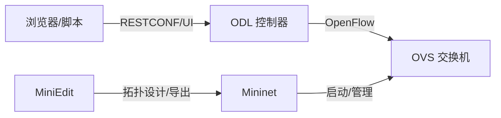

# Mininet / MiniEdit / OVS / ODL / OpenFlow 概念与安装流程

## 概念速览
- Mininet: 轻量级网络仿真器，使用 Linux 命名空间和虚拟以太网创建可编程的虚拟拓扑。
- MiniEdit: Mininet 的图形化拓扑编辑器，支持拖拽节点、生成并运行对应的 Python 脚本。
- OVS (Open vSwitch): 软件交换机，支持 OpenFlow、VLAN、隧道等，是 Mininet 中常见的虚拟交换机实现。
- ODL (OpenDaylight): SDN 控制器平台，提供 OpenFlow 控制、RESTCONF API 与可视化管理界面。
- OpenFlow: 控制器与交换机之间的南向协议，控制器通过它下发流表规则。

## 关系示意


## 安装与启动流程（从 Docker 到 MiniEdit GUI）
> 说明：仓库假设在 WSL/Ubuntu 环境中执行命令；X 服务在宿主机启动。

### 1) 安装并验证 Docker
- 安装 Docker（WSL 里使用 Docker Desktop 的 WSL 集成，或直接安装 docker-ce）。
- 验证：

```bash
docker --version
```

### 2) 使用 Docker 启动 ODL 控制器
- 进入仓库目录后启动：

```bash
docker compose up -d
```

- 验证：

```bash
docker ps | grep odl-controller
curl -u admin:admin http://localhost:8181/restconf/operational/opendaylight-inventory:nodes
```

> 端口说明：`8181` 为 RESTCONF，`6633` 为 OpenFlow（可在 [docker-compose.yml](docker-compose.yml) 中查看）。

### 3) 安装 Mininet / OVS / MiniEdit 依赖
- 在 WSL/Ubuntu 中安装：

```bash
sudo apt update
sudo apt install -y mininet openvswitch-switch python3-tk x11-apps
```

### 4) 安装并启动 X 服务（宿主机）
- Windows 上可使用 VcXsrv 或 X410，确保监听 `:0` 并允许来自 WSL 的连接。
- 启动后回到 WSL 终端进行显示配置。

### 5) 配置 DISPLAY 并验证 X 图形
```bash
export DISPLAY=$(ip route | awk '/default/ {print $3}'):0
xeyes
```

如果 `xeyes` 正常弹出，说明 X 显示链路可用。

### 6) 启动 MiniEdit
- 使用脚本自动启动 OVS 并打开 GUI：

```bash
chmod +x ./start_miniedit.sh
./start_miniedit.sh
```

脚本 [start_miniedit.sh](start_miniedit.sh) 会：启动 OVS、设置 `DISPLAY`（若未设置）、运行 MiniEdit。

### 7) 让拓扑连接 ODL（可选）
- 在 MiniEdit 中将控制器配置为 Remote Controller。
- 控制器地址填写 `127.0.0.1`，端口 `6633`（ODL 容器映射到本机端口）。

## 常见问题
- GUI 不显示：检查 X 服务是否启动、`DISPLAY` 是否正确、Windows 防火墙是否阻止连接。
- OVS 启动失败：确认 `openvswitch-switch` 已安装，或使用 [start_miniedit.sh](start_miniedit.sh) 重新拉起 OVS。
- ODL 连接不上：确认 `docker compose up -d` 已运行、`6633` 端口已映射、ODL 容器仍在运行。

## 可选扩展
- 使用 MiniEdit 导出 Python 脚本后，可在脚本中固定 OpenFlow 版本（如 1.3）以匹配 ODL。
- 通过 ODL 的 Web UI 查看拓扑与流表状态：`http://localhost:8181/index.html`。
